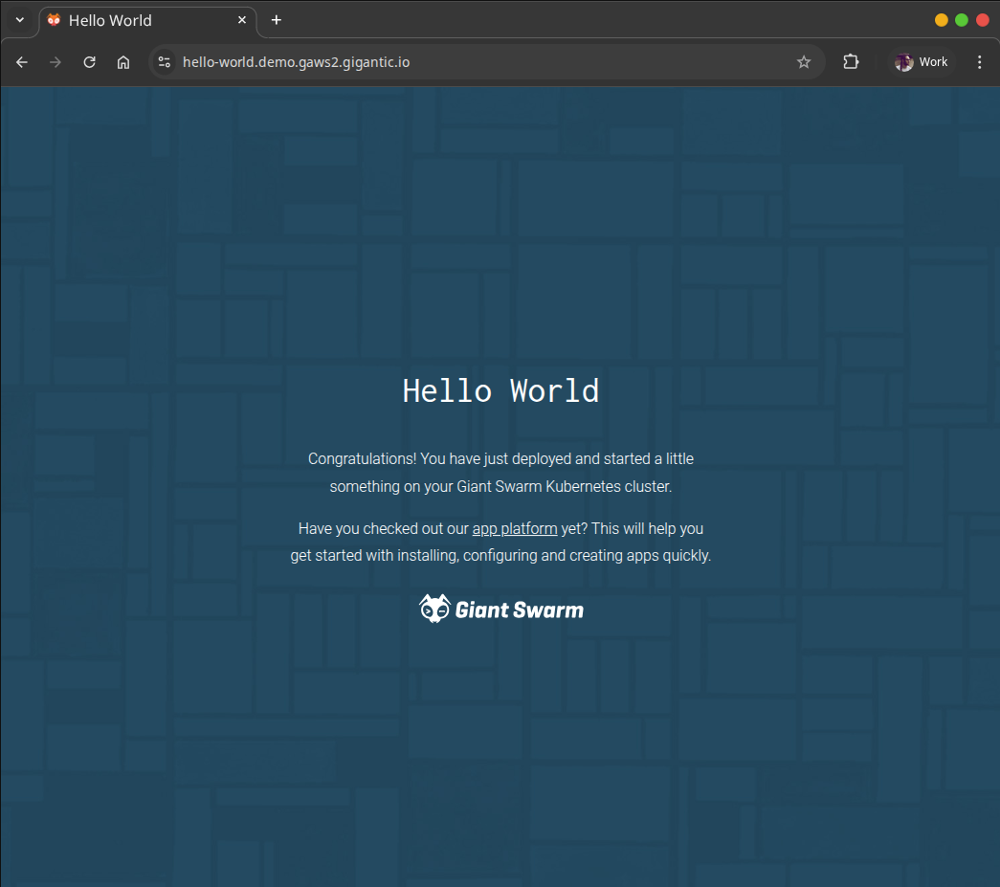

<div align="center">

[](https://github.com/giantswarm/helloworld/releases)
[](https://dl.circleci.com/status-badge/redirect/gh/giantswarm/helloworld/tree/main)

[](https://pkg.go.dev/github.com/giantswarm/helloworld)
[](https://goreportcard.com/report/github.com/giantswarm/helloworld)
[](https://github.com/giantswarm/helloworld/blob/main/LICENSE)

# Hello World

</div>


A minimal Go web application to verify your Giant Swarm Kubernetes cluster is working correctly. It serves a static "Hello World" page and is designed to be a quick smoke test after cluster setup.

## What it does

- Serves static HTML content on port **8080**
- Exposes a `/healthz` endpoint for liveness and readiness probes
- Exposes a `/metrics` endpoint with Prometheus metrics (request counts by status code)
- Logs HTTP requests using Go's structured logging (`log/slog`)
- Handles `SIGTERM` for graceful shutdown

<p align="center">
    
</p>

## Quick start

### Deploy on Giant Swarm

You can install this app directly onto your Giant Swarm cluster using the web UI or kubectl gs, with the pre-packaged [giantswarm/hello-world-app](https://github.com/giantswarm/hello-world-app). See the [official guide on installing an application](https://docs.giantswarm.io/getting-started/install-an-application/) for step-by-step instructions.

### Deploy to Kubernetes

A sample manifest is provided in `helloworld-manifest.yaml`. Edit the Ingress host to match your cluster's base domain, then apply:

```bash
kubectl apply -f helloworld-manifest.yaml
```

The manifest includes a Deployment (2 replicas with pod anti-affinity), a ClusterIP Service, a PodDisruptionBudget, and an Ingress.

### Run with Docker

```bash
docker build -t helloworld .
docker run -p 8080:8080 helloworld
```

### Run locally

```bash
go build .
mkdir -p /content && cp content/* /content/
./helloworld
```

The server starts on http://localhost:8080.

## Endpoints

| Path       | Description                          |
|------------|--------------------------------------|
| `/`        | Static HTML welcome page             |
| `/healthz` | Health check (returns `200 OK`)      |
| `/metrics` | Prometheus metrics                   |

## Learn more

To learn more about Giant Swarm, visit https://www.giantswarm.io/.
