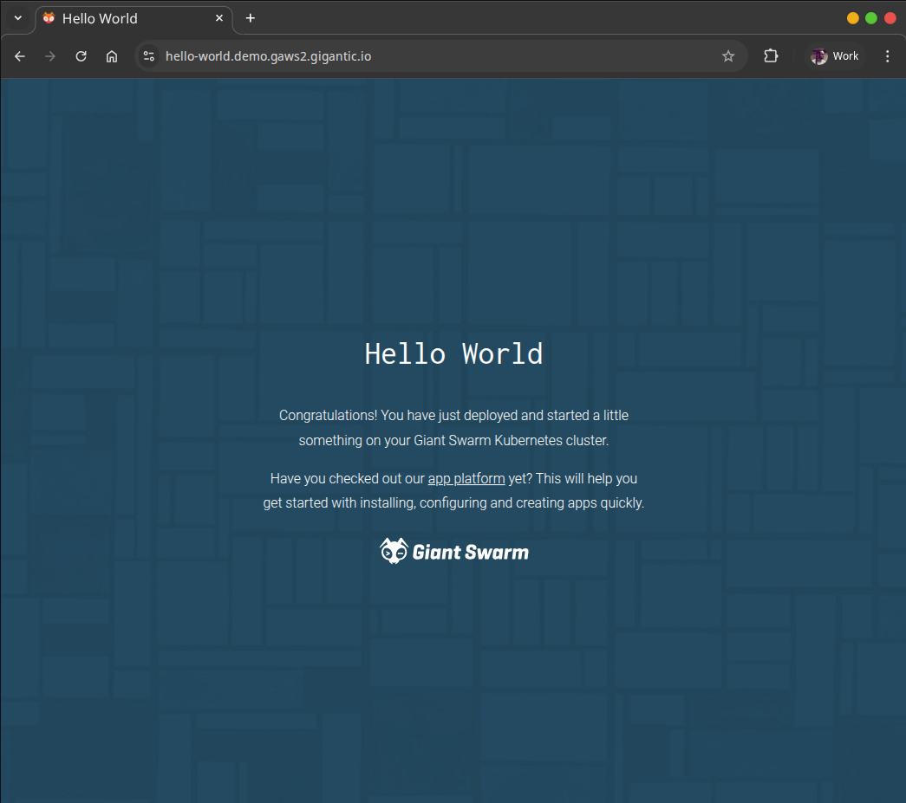

<div align="center">

[](https://github.com/giantswarm/helloworld/releases)
[](https://dl.circleci.com/status-badge/redirect/gh/giantswarm/helloworld/tree/main)

[](https://pkg.go.dev/github.com/giantswarm/helloworld)
[](https://goreportcard.com/report/github.com/giantswarm/helloworld)
[](https://github.com/giantswarm/helloworld/blob/main/LICENSE)

# Hello World

</div>


A minimal Go web application to verify your Giant Swarm Kubernetes cluster is working correctly. It serves a static "Hello World" page and is designed to be a quick smoke test after cluster setup.

## What it does

- Serves static HTML content on port **8080**
- Exposes a `/healthz` endpoint for liveness and readiness probes
- Exposes a `/metrics` endpoint with Prometheus metrics (request counts by status code)
- Logs HTTP requests using Go's structured logging (`log/slog`)
- Handles `SIGTERM` for graceful shutdown

<p align="center">
    
</p>

## Quick start

### Deploy on Giant Swarm

You can install this app directly onto your Giant Swarm cluster using the web UI or kubectl gs, with the pre-packaged [giantswarm/hello-world-app](https://github.com/giantswarm/hello-world-app). See the [official guide on installing an application](https://docs.giantswarm.io/getting-started/install-an-application/) for step-by-step instructions.

### Deploy to Kubernetes

A sample manifest is provided in `helloworld-manifest.yaml`. Edit the Ingress host to match your cluster's base domain, then apply:

```bash
kubectl apply -f helloworld-manifest.yaml
```

The manifest includes a Deployment (2 replicas with pod anti-affinity), a ClusterIP Service, a PodDisruptionBudget, and an Ingress.

### Run with Docker

```bash
docker build -t helloworld .
docker run -p 8080:8080 helloworld
```

### Run locally

```bash
go build .
mkdir -p /content && cp content/* /content/
./helloworld
```

The server starts on http://localhost:8080.

## Endpoints

| Path       | Description                          |
|------------|--------------------------------------|
| `/`        | Static HTML welcome page             |
| `/echo`    | Echoes the request (method, path, query, headers, body) as JSON, with `received_at`/`responded_at` timestamps. Add `?delay=2s` (any Go duration) to delay the response. |
| `/healthz` | Health check (returns `200 OK`)      |
| `/metrics` | Prometheus metrics                   |

## Staged failure injection (memory leak)

The app ships with an **opt-in, off-by-default** memory leak so it can be used as
a reproducible failure fixture (for example, to demo an SRE agent diagnosing an
`OOMKilled` crash loop). It is disabled unless explicitly enabled, and when
disabled the app behaves exactly as it always has.

When enabled it allocates and *touches* memory at a steady rate after a short
startup grace period, so the resident/working set climbs linearly until the
container hits its memory limit and the kubelet OOMKills it. HTTP probes keep
passing right up to the kill. On startup it logs a `WARN` line so the staged
failure is obvious to anyone inspecting the environment.

Configuration (environment variables):

| Variable | Default | Description |
|----------|---------|-------------|
| `MEMORY_LEAK_ENABLED` | `false` | Set to a truthy value (`true`, `1`, …) to enable the leak. |
| `MEMORY_LEAK_RATE_BYTES_PER_SEC` | `1048576` (1 MiB/s) | Steady leak rate, in bytes per second. |
| `MEMORY_LEAK_GRACE_PERIOD` | `30s` | Delay before leaking starts, so the pod reaches `Ready` first. Any Go duration. |

> **Note:** do not set `GOMEMLIMIT` when using this. A soft memory limit would
> make the Go runtime constrain itself instead of letting the kubelet OOMKill
> the container, which defeats the purpose.

Runtime controls (only served when the leak is enabled):

| Path | Description |
|------|-------------|
| `/leak/stop` | Pause allocation; the resident set plateaus and the pod stays alive. |
| `/leak/start` | Resume allocation. |
| `/leak/status` | Return the current state as JSON (`active`, `leaked_bytes`, `rate_bytes_per_sec`, `grace_period`). |

The `helloworld_memory_leaked_bytes` gauge (exposed on `/metrics`, and only
present when the leak is enabled) reports how many bytes have been leaked so far.

When deployed via the [hello-world-app](https://github.com/giantswarm/hello-world-app)
chart, just set `crash.enabled: true` (sane defaults for the rate and grace period
are applied for you, and can be overridden via `crash.rateBytesPerSec` and
`crash.gracePeriod`). These environment variables can also be set directly through
the chart's generic `extraEnv` value.

## Learn more

To learn more about Giant Swarm, visit https://www.giantswarm.io/.
